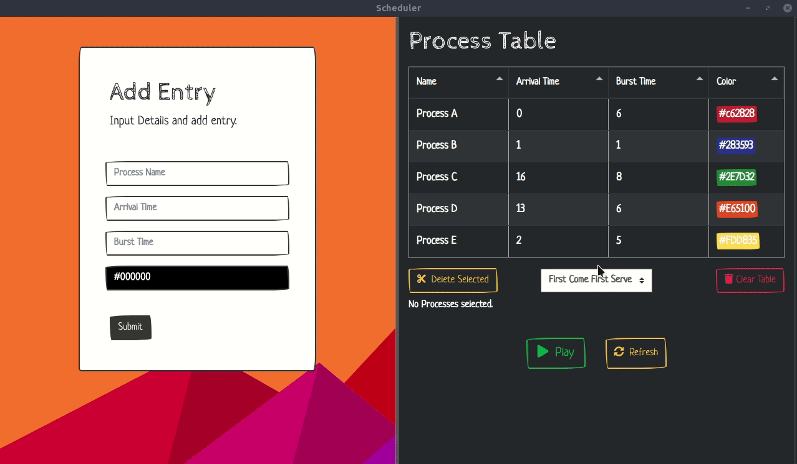

# OS Scheduler
By K. D. Sunera Avinash Chandrasiri (170081L)



## How to run

To run the web implementation either open index.html in browser or visit  [**https://kdsuneraavinash.github.io/os-scheduler**](https://kdsuneraavinash.github.io/os-scheduler/).

To run desktop implementation run these commands (You must have npm installed).
```bash
npm install && npm start
```
or if packages are already installed (in linux),
```bash
bash scheduler.bash
```


## Selected Scheduling Algorithm
My selected scheduling algorithm is Shortest Remaining Time First (SRTF) which is the preemptive version of Shortest Job First. In this algorithm, the process with the smallest time remaining until completion gets executed first. If a process is running under this scheduling algorithm, it is the algorithm with the shortest remaining time and thus it will continue to execute since its remaining time is getting reduced. However if a new process with a shorter time span arrives, the current process will get preempted and the new process will continue to get executed.

This has the advantage of little overhead and this algorithm will handle short processes very successfully. However this has the disadvantage of process starvation since long processes might get held indefinitely if shorter processes arrive continuously. Another problem with this algorithm is that it needs to know the burst times of each process before execution which is really unlikely outside of specialized environments. 

_Currently I have implemented this algorithm along with First Come First Serve, Shortest Job First and Round Robin in my implementation._

## Programming Languages/Stack used
I have decided to use a JavaScript based web application to demonstrate the scheduling process. Following is the libraries I have decided to use in this project.

| Library | Reason for Usage |
| --- | --- |
| [**jQuery**](https://jquery.com/) | Make DOM manipulation easier |
| [**PIXI**](http://www.pixijs.com/) | Add canvas animations to represent how process bursts happen |
| [**Am Charts**](https://www.amcharts.com/) | Add Gantt Charts and other charts to display data |
| [**Tabulator**](http://tabulator.info/) | Create interactive tables easily |
| [**Bootstrap 4.0**](https://getbootstrap.com/) | Make the web app responsive and build components easily and faster |
| [**Bootstrap Color Picker**](https://github.com/farbelous/bootstrap-colorpicker) | Let the user select colors to represent processes |
| [**Font Awesome**](https://fontawesome.com/) | Add icons to the UI |
| [**Electron**](https://electronjs.org/) | Integrate electron to use as a desktop app |


## Implementation (Use Cases &amp; UI)
My plan for implementation is as follows.
- User is given a table with process (Each Process has a name, arrival time, burst time and a color).
- User is also presented with a form. User can insert entries for the process table. Buttons to clear table or delete rows in the table are also given. Using those methods, process table can be easily customized.
- User can select the algorithm to simulate using a combo box. The algorithms in this box are given above.
- Then user has to press ![](data:image/*;base64,iVBORw0KGgoAAAANSUhEUgAAAGMAAAA0CAIAAAAR0hGNAAAAAXNSR0IArs4c6QAAAAlwSFlzAAAOxAAADsMB2mqY3AAACUJJREFUaEPtW01sG8cV3tk/7pJc/skUZTEN1URBnQIuYKEQChWo0bRFfXAb+OBLDjHQkw8JkEsODhAdXKA+9JAcegmKHnpp0frgQ4ygCKCDgdgtXMA5CE2CVGmkhLIkSlr+c7m7s7t5s0uKs9Qfd0U1AqUBtViK8/vNe99782YGvfDiRSZ4clgGJ1ic5HCax2nOklmHR47gfnjGFljvxWERwyEHMQznvrPdJ4cYxDjwJP9hGBbBk2TgIeu3nzIfVMY+rPf1Ax2AlB1Bel60EqylcDjuPhUOvuIUjxUWhvftj+l4eoCw8/xbRWT4avchBZPfnhJb35P0vKBPCnhMQKbNqxZfxazusLoNhb2X3T1ENgOZkckg7GaDd8wgw0YOw8BPlsM48GSQ7TC2Ay/dJ0MyWA4p7jhQ5CSk4uvjyYcN5UmL7kwPqfJPFfUXCb5uSf8zpK+NyFNDUC2ubsEIT1tSf5kwM1zur2V64EASnbT1csqOsoU767m/qclHDWnZ4GqnESaAQ9wwgXb65KOH1GkTnAPGK2xaxoQA1mZvmQLiID+MLE0HkAS+hsGU6wAWlXq4dSA6QwpcmobNOI45vg9SYKHOUgcBh+Frtpnm9tE+h2jf6TN0e4sH17DAo94PKVfxzrTPhYfVbJzaBylYXbhInUHlIeWYaX4/23dGUz0E2LZtxX1uAvXFo6hgIoWa18Y2ZwVYnIxY4jQb1rn7eAmwNANGh/V9gITMQrTyysTKrbHKheE5sTKHZYaROX060roQ0cbZ/79ZRqYDLhXECHbA4MayOe9L5SdxW2IzC7Ugy1TU/lGilWKcuND6oVKfRvyqLvaHKwIA72Vt3Jhc/1l8++VkDWCaiVdeSlQvCcLnWqTp/qwIrawjHLmVg7vV/m5Ee0FK/rPBaR13gPI8zRAyRTeHzOnE2pv54isxTQmMDl2ATCbWcr8vPj+/NnWrWPhLk89EN26mNY9hpxIbV6QjNTBAYWQQNGgFpJBytS8gT+1uk9VmM8X5ibWrkukzHQP0rpMFwoGM8KQeX+1MpvhYnbzfRplYeYbogg2RQvgMXl+onKyHVLSHD4WUGxsiEcijJ0Fo/Dy7Mp8NRfYQ+QSS8tGl8LAe05A+7a7vBQSfDoo8q1+KqdeS6mXJAGpzk6Xs4jWeJcQXJEGsjcxKrEfqNFJu68OLZDoJySP7cjCyh6AexJf9hgUb0Y0OBKCbEEQmfeUjm29NFq/FtXGxfiX71RspjcDB125Ors35i0+nvrozsVUIABXbJi3Y1IT1IzUcmaK6ZOWiWzcnl19LNfKDdhS0D2LwfYlMsSv1ACIJ0pOvZvxeaWp+I//eZuGdspSJb8+BCFh8jTGmfNEliGjbJo6UBu0A5CNRWWiLsn27ZCqYlzBg20D2CiH76/IA4V+ifRBJ9lWtSM08I6gYuusoXZmCKV80PPWwNSNaQu2LEgaQVcvKCyZV3igIjKpHtAF7S7JBKH1fpFjP9g2Fp/bqEqvq0c+MQaoHmByZ4hpeqNxItwRTeUyGDwLFCFx3JY/0y5ni7We++G1uO884GRFyiCsmGo/oPanktWmeX9L7g5gH4tZFak9Gd9mesMDQk2Yo90qF21uZRWsApEgHrJns8q3s2quZ0qvnvp7PbU4j8WE5ueqKj8tTru1Dreu54tUI93i78Hbx/KLDAL48wy3roiC2d5Q9LzdzVuxj/07LYWM8CCmPwwL66Ic1aOLow63C7Y2JB9QcH1bIhghazZDqCOfF1pRgq1rq76Vn7uqeonV2FQHNi5mNWSbx3vr5+5pYd8CrJr/CX6ktq1xzphOH0+fiek2LLx3Wqv93spkEsyL15IaSLndvyvGtdYLV7s9ti4uV/J21/F1NDEIQnkeHVmsTfyh958761O21wrvb2UcdPiJNeLaPR63Lsr1UzSx1FRG0EvbNSA5TWcTmpTjxVGW5PMPzi82ATgLsyLnyKx6z9vHLjdw7Twt/qkfVMFgTw7fjMe2qgPAUkR3eVBAH+2ydDKwFYJg265qMyIO6JMfUWc6cVRqykXwQTPXIVHmrYMoE0zI1BO1jVW3szyAF5cRK6Oip5yt1fctdSAETERwFLKg2flGpXBC1S8r6m+c3pkGmugZJbWYfYe1X2adXIujTeiKIf+A16BEhzdoUUi6jwzGCMGIAZXZo+2Niy4+UgGH2l6nIkgFhNrDUyl01YcqbN3PFGwl9ozr2KexgWzu9j7y/dW6VM2ScWGiFYRR3p4pGqhdLMHNC4wdy7D9aZI32RQ4eshtLiOHov9TJP1aSS4OYtkMxtIQ656jt+Je9YdNluC+bmQVNhDnXcOyjWvJJK/VhNfNvQ/6kLX/elnZiDDZqzyntSjX3gRkCKdDx8ksJTrNSH3kRDGr3j20Rt9RjgYGTHV3YDkXbB7UgPi6PLwzkeRE1LeFOBEYz5e6iGv5vXUyVp2zlH03fVtTAA/OW4HtrH9dy14TBkGLExVY42h68z6FyCtWrUXu5mv4sVGnCU5727WX7PKQCylTIfhx3MTybLOdw8l5YgSIyub9MsR5SlAdx3OM5rvr5SPmKjBYr6ZXwLXRML2WBe9LV1b7wtZ+Ykpa8WM++r4Ug8t4QXEeAHBPsJsqg22Q7kPZKT8zIA3YE4/i9ihLch/I14+6o0xENn+sDW8x07CpgB0cr+0EyBRa3atmRo7qNowFY9+RPb6Xhw4WvWPTqeTTGfKRR7M1TJARtw5bfkaoemcKe9lFE1SdT+IynOnPtqR1lPv1IVS2L2rcZGfkYykB8SAmbIFPktsJQqh6xSnxIiSUSB+s7DTNiAw49HB9SEGYXtjDchgld3QgX7Ld0cGjdPBfyQMEIwwRD60cKLoEY2dOHFCIb6yAi7WfF5vel6lx87TdjcNzl3P3KzvT338XSnhM3f5169t0jrpqGL14OLOvhApx7v43cdYNAOxxJhctwQBXUpTf39tterXMIlrS2iByRnB+DpYgdg0tlHLl4B58Ey3CkGPCP+NSQVozof9vRT9re/oWXdt1aQ8wXv8uDBRz+WE9MjbDvAmfzuSbcn7L5msVV4SgD+QjbFsDknUjYnfa431f9cbx0PX1ixnVIR2DY5G4c3IczyDYECIX3AuE2ggU8W933JgCEASPYsAgxuoNuQoaoboSLjLKWDXfavgE+47pDrikS2AAAAABJRU5ErkJggg==) button to start the simulation.
- In the simulation, each burst will be represented by a square of its process color. The blocks will be drawn in real time. User can hover the mouse over any block to see the time burst happened and the details about that process. Also the progress of the currently selected process will be show as a progress bar.
- At the end of simulation the user can view the gantt chart using ![](data:image/*;base64,iVBORw0KGgoAAAANSUhEUgAAAIQAAAA0CAIAAADE7AeFAAAAAXNSR0IArs4c6QAAAAlwSFlzAAAOwwAADsMBx2+oZAAACvdJREFUeF7tXHlUVNcZZ2AcZlhmGMBhX2VToxGFQbQmKtj2tFFBE9Fol5O6xub0j5zUNvV40pz05DTHo6HWpnWNTXrS5FhjYl3qkhhbFzZBUwUqCrLJIiDLrCzT33t3eL5583gM4DxNeHc48Oa9e+/33W+73/2+jydLnDzNY1TN09NT7e+vCcBHo9VqVUqlfAL9kcsnTBi8ksu9vLzQk2n4JpNR38gF9Yw8p2/iGp9RofONHHTq9JkzZ88xqMuEmaFQKMLDw0B0qvn5+flTH7XaX6PR4KZMJvtG0uCJQbq/v+83297o7e0jGHGZAfrGxEQnJyVFhIehBWq1fX197R0dnZ2dVqvVYrEOfqweNhtnUf0DA+jcS5r9ivo6QLV+PLUN2PCbfCW/Br/a79L9+p8YWrkdkc2bNly6fKW07BoPM559Zt6irIVd3d01NTV19Q2N9+61t7d3d/e4HanxCmBRdlZgoPbjTw4TAniy6bDkuR+qVKp3tu/45PCRy1cK7t6tlTjhVjlpaWmJCA9nQDgww62ApcmdKdB6/35oiI7Zeh2YYXPaBiQKupUCXV3dXl7y0NAQHjNFmCH5SG5lAHvynp4em4dNN1HHy4wB0fCQABEKQDkCAjS8zKC9Xen0IKKkQDm0AQE8zMBBQEQ0JFAUBcxmM79meNDHOEkzxBQTMAPBpCE3cDFRkWCZzGaEmYZkBuJ1Eo1EowA0w9/Pl4cZiCfhrsQM0TgBQIj44aiBgCxFeTbgvn6KGcPuGcHBQd//3nfFxPhbDMtq7cXqfH0p5XBkRh8VMUV+QXjxGrVGnz7LFQIhADx3Tua0p6a60pnIQVJiYnrarPj4OCRCXBw1xm4REeFps2ZOTklRKpVkKqQLRIOOqDYg+jkzA+F1iiLDMYN38UhwpCQnTYqPZz99auqUZTlL531nriv08vb2/vnLG3NzFoeGhGRm6H/12qv69DRXBjJ9YGDBfvYQkvgSmCQ3Z8mGdWujo6KmTEn5xSubl+UuRecF85/BWkYEmuk8LETOtDBTQpoxuj0jJTl53c9eWv1i3ujWgFHZWQsQj9m+I//Y8RN/++jj/D/urrp9Z0Sz+fioFs5/lj0kJiYGAjHUJKB46owZO9/9w5Gjn/3jyNHtO94tKChCZyQr0UYEmuksDNF5zkFm+OARx0w9zg08dcbTZ899ySSXenoMyKYw2MfHxc3O0Ot09jAOY1LYy4NucSTJ21shIFvgREFhUceDB2QSgG5obKSYASPFZyRhvlKB5fRpzFOFYgKHvsIQnZlhsVhwkyzHgf+D3tRYk6m/f/stuZf80Acfui5cwUFB2gBtdU0N75BVeSsg9Q86Oxc/94O9+w/W1Nxds3pVXW1dZmaG0lsJTbp46TKMYcKk+KioyNWr8ixW67kvzkNLsB9QmeOwMJPJdPTzY5zJExMnQSF4IUZFRmbo9WFhIdXVNYePfIq8Tmho6E9+tPrWraro6EjsavsOvI+BG9evO//VBYAG6U6c+pc+LU0YojMsInwQI37NeCwlAYGBgQajkYiJc/v0s8/3HzwEwl28eDlrwXwKe4UCu33+rj99+dUF5MRQAdHW1g4ZR2L4VtXtq1fLDAbDvaYmo8mEhHFFZWXJ1VKOlwiNgSfSxlI+Bi6C13p9WmlZ2Z69B2CvVq54AY9aW1t30Abtz3v2JyYkREZE4CbYnKFPP3nqdGFxCdAQhsi7tD7aaeJhBtnZUbjhukQ/vyx3/dqXnp4+3fUhvD0h+L291FbG23AywrKxuyYnJ8XGxqAPDMWNm+UdHR1nz32BryG6kJvl5de//i80oLCo+E51NWwx0su1tbVNTc1IMtfV13OyNchpYiDxLDkNPUtLr10pKKxvaDh95mxiYgI4BxFGih7O4YoXluMCaKAIBmhAUwGutLTsvb/sFYY4BDOorQHGjasZZDOBxXSdsnFxsaheCAoKdH0Ib08sz1tBqSppCGTClcrOWgi/AF/hHG/csLa9vaO4uMRH5TNY+EOZU9DoflubVhtABjpvvF5y/uWAbQiMktMWlxkeNmaUyWyBqaDrj+SbNqybOmVyUVExMnTYPyBA7NAqlkDmGQoiPzNoD1bpbKag4yOda4w8YIbDKENUibZSTSYLCdHNmzsnJjrK18cHwrh330FYZ9gBCkOq5grN7n3AuBExR7EJpJWNEqRZ4XiHeQrawbJFRjxMQTOPoBmo4yJfUa5CLhZlZ8P07dl3oLyiEhAhECoV5QJxmgBEXlr1EzNFb+AO3hTKcOiljkAzHhUzQGVIGXM8hP059s8TEHnMn5KSDFMDO0PxyNMTlEIhEM2Lh44GEfAeQw9qutgogXxqjT1144wqzFp6Gt9RxoaYkH1y4tSgwYv6938ukmsAhxVRqZTO0QphiM44oKYJN4nEODADRVG4NSIzhT0TJIPKw6zjApYEM7S1teEa6BoMRlx0dnYNyzMMr6iohF3yo6NmIO7SJYtjY6jtAdSH5wdDgW0je+ECIjFUDeJgEow5FgA6lAPeJyVrtJI1NDTGx8VODA5GZ2c3tLCwKC4uJnN2BkEPUgjbiFObhwzktlOGhIgIGjBNmAT6ipIOKIePSsUoELNAYYjOdCAHbVhB6jf7MTxCGqcRnHf27T/IzHDt+tfk+p3tO8lFReX/YFuG5QTpANfzlc2bfr3lNfgtSAuDzSjcwn3IL+j19ltvmi3mkpJSnW4iIRwoRgYajUYSwoHlOX/hwppVK/OeX44Tw67d70GfamvrtvzyVfgmly5dgRPMRgaCAv1bviwHGmm2WJISEgZstvfbPkBeh+E0PCt6M7AdP3HyxZV5gFteUdHS2gpRsxJ/x9OT2S3wVRiiMykgPTQzKGvkUFE4J3P28tycA4f+euPGTQEKIubx8sb1LpKY3W3L61sZrecdju1hZuoMtUbd3Nxy7fr1mampoGl9fQM6q9Xq7u5uiCfOfSg34pCAPRt6glBQNXITZNWo1Qajgami5IBGNAyxKZDj9p3q4pKrQ7nXGAW1wPkJ7jK0B6YAPXGB0w9nwmEhsvsDt21bX4fbtjN/lwMzZs1MBfM//OjvcNQEaA2/Ah76KJhB9gCpsSmAzNJvt21tbmmGOXHYM4xGE/qhjlyYXhAxkHUUPxIbeMwU7RCTrcGRGSYjxYwhfEGJlO6gANlvYGycmGGQmOEOggvNibp7PCZnVY6Zopjh7AKKjeB4god/lCBehrOZovcMyUyJKA0kYkbOK9zCZ5PZxI4RiYjVOAXFrm/mprtxZubN24xTUom1bBLa4TID0X+l8mH0VCxkxi+cIc0USII4kre3vUhi/FJI9JUPoRldkmaIygqhPQOaIe0ZonKDBsbjTdFmqtPXlydnIj5+4xAidwNHQlGlVD2W/NI4pD5nyVxmtLS0ogfJ8EhNZApwmYH8PtJ1an+1yHhI4HjOGbiFxA7qzCXqiE8BnoJzJDt1E6nUptTcQQE4q6jYi4yMQN070sk//fEapISPnzwFWDxv1UEpFIrj8nftdgcqT/6cVNkJ/QYm8vIl8oamwRc12f+SP7yll7iLago01Dwi/o26CF8fX7yECFX6+IH9J7W/qENovNeE/PytqirU/pBsNP8rjn735hvSaWPscoO3BqF8Gw3/X4z/9+7ssjdUscD8sMsYCCx+ZkB9ULc5dmy+TTOAstSbm+gPeYkT+YPaFFQJI2NN/zUh0oqGCi6wgSmKcJEOw7z8y8VZpG6PhALSP7Y+EjI+mkn+DyofInmaqQvlAAAAAElFTkSuQmCC) button.

## Current Progress
**A working version can be found** [**here**](https://kdsuneraavinash.github.io/os-scheduler/) **.**
